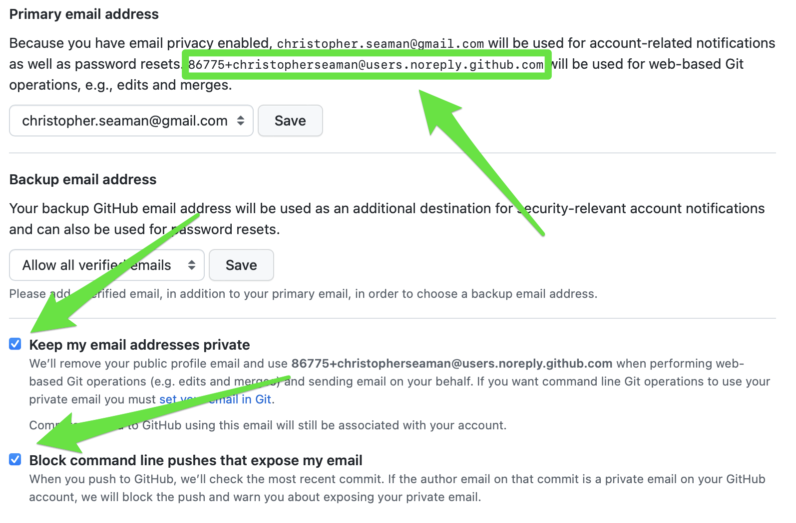
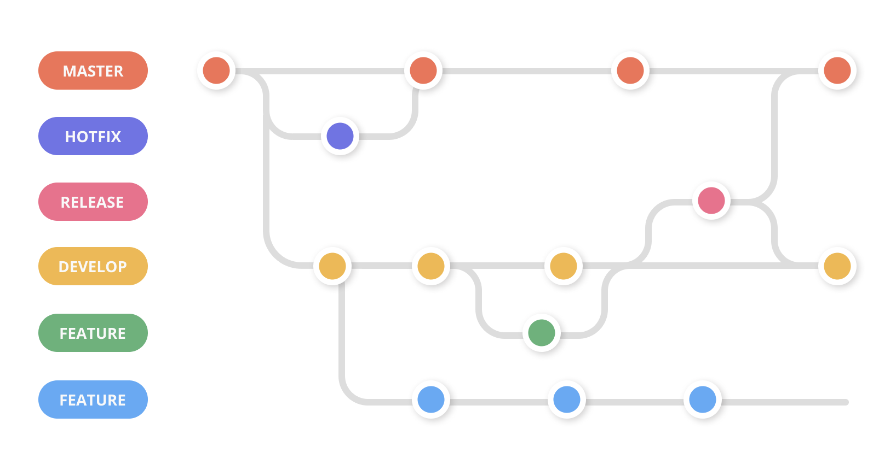
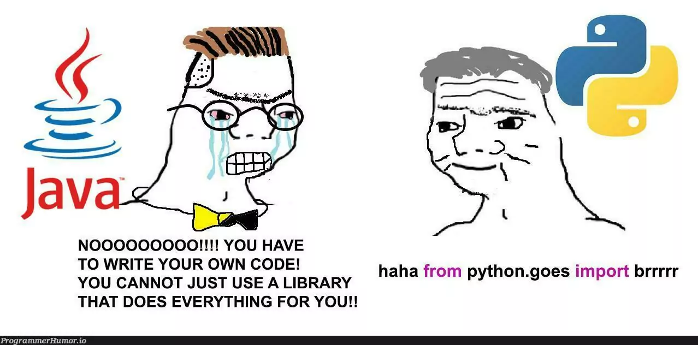

# Lecture 02
- `git` and GitHub
- Markdown
- Python environments and packages

---
## Notes from last lecture

- `wsl --install`
- Open `Ubuntu` from Start
- Files from Windows available at `/mnt/c/Users/<user name>`

---

## Getting started with `git`

Atlassian has an [excellent tutorial on git](https://www.atlassian.com/git/tutorials/what-is-version-control), the _Getting Started_ and _Collaborating_ sections will be most applicable early on.

---
## Configuring with your name and email

We need to tell git who we are. We do this using `git config` to

`git config --global user.name "<YOUR NAME>"`

`git config --global user.email "<YOUR EMAIL>"` to set your email address

---

## Important note!
Having your email address listed in a public repository is a **bad idea**. You will get targeted for spam or worse. GitHub will set up an anonymous proxy email address automatically, you can find it https://github.com/settings/emails while logged in.  

---



---
## Cloud options

We’ll work with GitHub here, but other options include [GitLab](https://gitlab.com/) and [Bitbucket](https://bitbucket.org/). UCSF also has an [internally-facing version of GitHub](https://it.ucsf.edu/search?search=github), which you should definitely use if you’re working on anything PHI-related. Access to [UCSF’s GitHub](https://git.ucsf.edu) and High-Performance Computing (Wynton) must be requested from IT.

---
## `git init` and `git clone`

You can create a new repository in the current directory with the `git init` command. This adds a hidden folder `.git` with the configuration for the repo. You can later add the repo to a remote host (like GitHub) where others can access it

To copy a remote repository to your local machine use the `git clone` command. This will copy the repository and all its version history to a subdirectory with the same name as the repository you’ve cloned.

---
To clone the notebooks that accompany the book Python for Data Analysis:

`git clone` `[https://github.com/wesm/pydata-book.git](https://github.com/wesm/pydata-book.git)`


---
## Commit

You save a snapshot of your work using `git commit` commands. Each commit will need a short message to describe the changes you’ve made.

1. `git status` - to see what changes you’ve made since the last commit
2. `git add <FILE>` - add files you’ve changed to _staging_ (included in the next commit)
3. `git commit -m <MESSAGE>` - commit your work with a quick summary
---
## Push ⇄ pull

If you have a `remote` set up, it does what it says on the tin. Cloning from GitHub always adds GitHub as a `remote`

- `git push` will add your local commits to the remote copy
- `git pull` will download any changes from the remote to your local copy
- `git sync` (not all systems) will perform both a pull and push

---
## Fork, branch, and merge

Sometimes you want to work on something outside the “main” flow of a repository. Maybe there’s an analysis or model you’re working on that isn’t complete. By creating a separate **branch** of the repository, you can do your work without worrying about breaking the **main** or **trunk** branch of the repository. If you want to make your own work based on another repository, you can **fork** it, creating a copy that you own going forward.

---
## Branch workflow

It makes it a lot easier when collaborating with others to keep a clean and functional `main` branch. If you’re an imperfect human, then you probably can’t ensure that every commit you make along the way is also clean and functional. Mistakes happen.

One solution is to use a **branch workflow**, where work-in-progress happens in dedicated branches. Once a piece of work is deemed complete, it can be merged into the main branch.

---
## Branch workflow II

A best practice when merging work into the main branch is to use a **pull request** or **PR**. 

A pull request signals that your work may be complete and you’d like someone else to review it and give feedback. This ensures not just that the changes you’ve made are correct, but that they are understandable to others. Once the reviewer gives the 👍 (and conflicts are resolved), your development branch can be merged into the main branch.

---



---
## Sensitive information

Never ever. Not once. This goes for passwords, PII, and PHI. Don’t put it on GitHub.

---

## Getting into conflict

Sometimes your repos will get into states that can’t be resolved automatically and non-destructively. Generally, this occurs when the local and remote both have changes to the same file.

---

## Conflict resolution

There are a few ways to resolve git conflicts:

- `git restore <FILE>` - discard all changes to `<FILE>` since the last commit
- `git rebase` - discard all changes
- `git stash` - save the current state in a local “stash”, then rebase the repo to the last commit

Read more on merge conflicts in [Atlassian’s tutorial](https://www.atlassian.com/git/tutorials/using-branches/merge-conflicts)

---


---
## Best Practices

- Communicate with your team about merge conflicts
- Pull changes frequently to minimize large conflicts
- Use feature branches to isolate work
- Consider using `git rebase` for a cleaner history

## Conflict resolution: command line

1. Pull the latest changes: `git pull origin main`
2. If conflicts occur, Git will notify you
3. Open the conflicting file(s) in a text editor
4. Look for conflict markers: `<<<<<<<`, `=======`, `>>>>>>>`
5. Manually edit the file to resolve the conflict
6. Save the file
7. Stage the resolved file: `git add <filename>`
8. Commit the changes: `git commit -m "Resolve merge conflict"`
9. Push the changes: `git push origin main`

---

## Conflict resolution: VS Code

1. Pull changes in VS Code's Source Control panel
2. VS Code will highlight conflicts in the editor
3. Click on "Accept Current Change", "Accept Incoming Change", "Accept Both Changes", or manually edit
4. After resolving all conflicts, stage the changes
5. Commit and push the resolved conflicts

---

## Conflict resolution: GitHub web interface

1. When a pull request has conflicts, GitHub will notify you
2. Click on "Resolve conflicts" button
3. GitHub's web editor will show the conflicts
4. Manually edit the file to resolve conflicts
5. Click "Mark as resolved" for each file
6. Commit the changes
7. Complete the merge
---

## LIVE DEMO

1. Clone a repo
2. Make changes
3. Push
4. Make changes remotely & locally
5. Conflict!
6. Branch...

---

#TODO-FIXME
## Markdown

Markdown is a lightweight markup language for writing documents. The format was created as an alternative to HTML, while retaining most of the capabilities. It’s the most common format in many tools, including GitHub, Notion, and Google Docs (when enabled).

- [https://www.markdownguide.org/basic-syntax/](https://www.markdownguide.org/basic-syntax/) (cheat sheet)
- [https://www.markdowntutorial.com](https://www.markdowntutorial.com/) (self-guided tutorial)
- https://commonmark.org/help/tutorial

---
## Paragraphs

Start a new paragraph by separating it from the previous one with a blank line

```markdown
Lorem ipsum dolor sit amet, consectetur adipiscing elit, sed do eiusmod tempor incididunt ut labore et dolore magna aliqua. Ut enim ad minim veniam, quis nostrud exercitation ullamco laboris nisi ut aliquip ex ea commodo consequat. 

This is a new paragraph!
```

Lorem ipsum dolor sit amet, consectetur adipiscing elit, sed do eiusmod tempor incididunt ut labore et dolore magna aliqua. Ut enim ad minim veniam, quis nostrud exercitation ullamco laboris nisi ut aliquip ex ea commodo consequat.

This is a new paragraph!

---
## Headers

Starting a line with hash symbols `#` will creating headings within your document:

# `# Header 1 (biggest)`
## `## Header 2`
### `### Header 3 (smallest commonly supported)`

---
## Font Styles

There is some variability in how these are applied between Slack, Notion, GitHub, etc.

- **Bold** - double-asterisks `**` around a word to **`**bold**`** (some apps allow single astersisks)
- _italic_ - single underscores `_` around a word to _`_italicize_`_ (some apps also confusingly also use single asterisks for italic, too)

> Blockquote - prefix text with a greater-than sign to `>` blockquote (Notion uses the pipe | symbol). To blockquote multiple paragraphs, include a ‘>’ on the blank line between them

```JSON
> This is Blockquoted
```

---
## Lists - unordered

**Unordered lists** start with an asterisks, hyphen, or plus sign. Indent with additional spaces to make sublists:

```markdown
* one
  * two
* three
```

- one
    - two
- three

---
## Lists - ordered

**Ordered lists** start with numbers and indent similarly to undordered lists, but it actually doesn’t matter which digits you use.

```JSON
1. asdf
  3. jfjf
7. btbk
```

1. asdf
    1. jfjf
2. btbk

---
## Lists - checklists

**Checklists** start with bracket pairs `[ ]`, completed items with an x inside `[x]`. **NOTE:** VS Code needs an extension to support completed items within a checklist

```JSON
[] do this
[x] this is done
```

- [ ] do this
- [x] this is done

---
## Code

Code is marked with surrounding backticks `` `code goes here` `` and can be included inside a paragraph  Larger blocks of code, spanning multiple lines begin and end with three backticks

````JSON
```
This is a large block of code

across multiple lines
```
````

```JSON
This is a large block of code

across multiple lines
```

---
## Links

You can create links by surrounding the link text with [] brackets, then the url surrounded by parentheses:

```markdown
Neat collection of [data science notes](badmath.org/datasci)
```

Neat collection of [data science notes](badmath.org/datasci)

---
## readme.md

This is your repository's introduction to the world. Please write something!

---
## LIVE DEMO


---

## Python Virtual Environments


---

## Python Packages


---

## Installing packages with pip

---

## Importing packages


---
## Please, `ignore` the mess...


---

## Practical

---

## Links

- [Data scientists work alone and that's bad | Ethan Rosenthal](https://www.ethanrosenthal.com/2023/01/10/data-scientists-alone)
- [I Used Computer Vision To Destroy My Childhood High Score in a DS Game](https://betterprogramming.pub/using-computer-vision-to-destroy-my-childhood-high-score-in-a-ds-game-38ebd53a1d64) 
