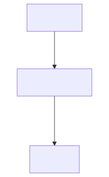

# Lecture 06: Are you ready to wrangle?!?

1. Introduction to Data Wrangling with pandas
2. Combining and Reshaping Data
3. Practical Data Cleaning Techniques
4. Additional Data Wrangling Techniques

---

> "Data is the new oil. It's valuable, but if unrefined it cannot really be used."

\- Clive Humby

---

## Key pandas Data Structures

- Series: 1D labeled array
- DataFrame: 2D labeled data structure

```python
# Series
s = pd.Series([1, 3, 5, np.nan, 6, 8])

# DataFrame
df = pd.DataFrame({'A': [1, 2, 3], 'B': [4, 5, 6]})

# Selecting columns
df['A']  # Returns a Series
df[['A', 'B']]  # Returns a DataFrame
```

---



---

## Reading Data into pandas(review)

Common file formats:
- CSV: `pd.read_csv()`
- Excel: `pd.read_excel()`
- JSON: `pd.read_json()`
- SQL databases: `pd.read_sql()`

Example:
```python
df = pd.read_csv('patient_data.csv')
```

#FIXME: Provide a visual flowchart of the data reading process.

---

## Basic DataFrame Operations (review)

- Viewing data: `df.head()`, `df.tail()`, `df.info()`
- Selecting columns: `df['column_name']` or `df.column_name`
- Filtering rows: `df[df['column_name'] > value]`
- Adding new columns: `df['new_column'] = values`

#FIXME: Use diagrams to show how data is selected and filtered.

---

## Handling Missing Data

- Detecting missing values: `df.isna()`, `df.isnull()`
- Dropping missing values: `df.dropna()`
- Filling missing values: `df.fillna(value)`

```python
# Fill missing values with the mean of the column
df['age'].fillna(df['age'].mean(), inplace=True)
```

---



---

## Data Type Conversion

- Checking data types: `df.dtypes`
- Converting types: `df['column'].astype(type)`

```python
# Convert 'age' column to integer type
df['age'] = df['age'].astype(int)
```

---

## Renaming Columns

```python
# Using rename with inplace
df.rename(columns={'old_name': 'new_name'}, inplace=True)

# Using a list comprehension to modify column names
new_columns = [col.lower().replace(' ', '_') for col in df.columns]
df.columns = new_columns
```

#FIXME: Include a visual example of before and after renaming columns.

---

## Sorting Data

```python
# Sort by a single column
df_sorted = df.sort_values('age')

# Sort by multiple columns
df_sorted = df.sort_values(['age', 'name'], ascending=[True, False])

# Sort by index
df_sorted = df.sort_index()

# Sort in place
df.sort_values('age', inplace=True)
```

---

## Grouping and Aggregation

```python
# Group by 'city' and calculate mean age
df.groupby('city')['age'].mean()

# Multiple aggregations
df.groupby('city').agg({'age': 'mean', 'name': 'count'})

# Named aggregation
df.groupby('city').agg(
    mean_age=('age', 'mean'),
    total_patients=('name', 'count')
)
```

---

## Quick Data Visualization with pandas

### Basic Plotting in pandas

```python
# Line plot
df['column'].plot(kind='line')

# Histogram
df['column'].hist()

# Box plot
df.boxplot(column=['col1', 'col2', 'col3'])
```

These simple plots can quickly reveal distributions and trends in your data.

---

## Advanced Plotting with Seaborn

Seaborn is a statistical data visualization library built on top of matplotlib.

```python
import seaborn as sns

# Scatter plot
df.plot.scatter(x='col1', y='col2')

# Correlation heatmap
sns.heatmap(df.corr(), annot=True)

# Pair plot
sns.pairplot(df)
```

These plots help visualize relationships between multiple variables simultaneously.

---

# LIVE DEMO!

---

# 2. Combining and Reshaping Data

---

## Concatenating DataFrames

```python
df1 = pd.DataFrame({'A': ['A0', 'A1'], 'B': ['B0', 'B1']})
df2 = pd.DataFrame({'A': ['A2', 'A3'], 'B': ['B2', 'B3']})

result = pd.concat([df1, df2])
```

Result:
```
    A   B
0  A0  B0
1  A1  B1
0  A2  B2
1  A3  B3
```

---

## Merging DataFrames

```python
left = pd.DataFrame({'key': ['K0', 'K1', 'K2'],
                     'A': ['A0', 'A1', 'A2']})
right = pd.DataFrame({'key': ['K0', 'K1', 'K3'],
                      'B': ['B0', 'B1', 'B2']})

result = pd.merge(left, right, on='key')
```

Result:
```
  key   A   B
0  K0  A0  B0
1  K1  A1  B1
```

---

## Types of Joins

- Inner join (default): `pd.merge(left, right, how='inner')`
- Outer join: `pd.merge(left, right, how='outer')`
- Left join: `pd.merge(left, right, how='left')`
- Right join: `pd.merge(left, right, how='right')`

---

## Reshaping Data: Melt

Melt transforms "wide" format data into "long" format.

```
   A  B  C
0  a  1  2
1  b  3  4
2  c  5  6
```

After:
```python
melted = pd.melt(df, id_vars=['A'], value_vars=['B', 'C'])
print(melted)
```
```
   A variable  value
0  a        B      1
1  b        B      3
2  c        B      5
3  a        C      2
4  b        C      4
5  c        C      6
```

---

## Reshaping Data: Pivot

Pivot transforms "long" format data into "wide" format.

```
   A variable  value
0  a        B      1
1  b        B      3
2  c        B      5
3  a        C      2
4  b        C      4
5  c        C      6
```

After:
```python
pivoted = melted.pivot(index='A', columns='variable', values='value')
print(pivoted)
```
```
variable  B  C
A            
a         1  2
b         3  4
c         5  6
```

---

## Stacking and Unstacking

Stacking rotates from columns to index, unstacking does the opposite.

```
   A  B
x  1  3
y  2  4
```

Stacked:
```python
stacked = df.stack()
print(stacked)
```
```
x  A    1
   B    3
y  A    2
   B    4
dtype: int64
```

---

Unstacked (back to original):
```python
unstacked = stacked.unstack()
print(unstacked)
```
```
   A  B
x  1  3
y  2  4
```

---

# LIVE DEMO!

---

# 3. Practical Data Cleaning Techniques

## Handling Missing Data

```python
# Detect missing values
df.isna().sum()

# Drop rows with any missing values
df_clean = df.dropna()

# Fill missing values
df['column'].fillna(df['column'].mean(), inplace=True)

# Forward fill
df.ffill()

# Backward fill
df.bfill()
```

---

## Handling Duplicates

```python
# Check for duplicates
df.duplicated()

# Remove duplicates
df_clean = df.drop_duplicates()

# Remove duplicates based on specific columns
df_clean = df.drop_duplicates(subset=['column1', 'column2'])
```

---

## Handling Outliers

1. Identify outliers (e.g., using Z-score or IQR)
2. Decide on a strategy: remove, cap, or transform

```python
# Using Z-score
from scipy import stats
z_scores = np.abs(stats.zscore(df['column']))
df_clean = df[(z_scores < 3)]

# Using IQR
Q1 = df['column'].quantile(0.25)
Q3 = df['column'].quantile(0.75)
IQR = Q3 - Q1
df_clean = df[~((df['column'] < (Q1 - 1.5 * IQR)) | (df['column'] > (Q3 + 1.5 * IQR)))]
```

---

## String Manipulation

```python
# Convert to lowercase
df['name'] = df['name'].str.lower()

# Remove whitespace
df['name'] = df['name'].str.strip()

# Replace values
df['name'] = df['name'].str.replace('old', 'new')

# Extract substrings
df['domain'] = df['email'].str.extract('(@[\w.]+)')

# String methods with regex
df['name'] = df['name'].str.replace(r'^Dr\.\s*', '', regex=True)
```
---

## Regular Expressions (Regex) in pandas

- Powerful pattern matching tool, similar to command-line use
- Used with string methods in pandas for advanced text processing
- Common patterns:
  - `\d`: any digit
  - `\w`: any word character
  - `\s`: any whitespace
  - `+`: one or more
  - `*`: zero or more
  - `[]`: character set
  - `()`: capturing group

---

## String Manipulation with Regex

```python
df = pd.DataFrame({
    'text': [
        'Contact: john@email.com, Phone: 123-456-7890',
        'Meeting on 2023/05/15 with Jane (jane@company.com)'
    ]
})

# Extract email addresses
df['email'] = df['text'].str.extract(r'([\w\.-]+@[\w\.-]+)')

# Extract phone numbers
df['phone'] = df['text'].str.extract(r'(\d{3}-\d{3}-\d{4})')

# Extract dates
df['date'] = df['text'].str.extract(r'(\d{4}/\d{2}/\d{2})')

print(df)
```
```
                                               text               email         phone        date
0  Contact: john@email.com, Phone: 123-456-7890    john@email.com  123-456-7890        NaN
1  Meeting on 2023/05/15 with Jane (jane@company.com)  jane@company.com          NaN  2023/05/15
```

---

## Working with Dates and Times

```python
# Convert to datetime
df['date'] = pd.to_datetime(df['date'])

# Extract components
df['year'] = df['date'].dt.year
df['month'] = df['date'].dt.month
df['day'] = df['date'].dt.day

# Calculate time differences
df['time_diff'] = df['end_date'] - df['start_date']

# Resample time series data
df_daily = df.resample('D', on='date').mean()
```

---

## Categorical Data and Encoding

```python
# Convert to category type
df['category'] = df['category'].astype('category')

# One-hot encoding
df_encoded = pd.get_dummies(df, columns=['category'])

# Ordinal encoding
from sklearn.preprocessing import OrdinalEncoder
enc = OrdinalEncoder()
df['category_encoded'] = enc.fit_transform(df[['category']])
```

---

## Binning Data

```python
# Create age groups
bins = [0, 18, 35, 50, 65, 100]
labels = ['0-18', '19-35', '36-50', '51-65', '65+']
df['age_group'] = pd.cut(df['age'], bins=bins, labels=labels, right=False)
```

---

## Advanced Categorical Data Operations

Example: Managing categories in a DataFrame

```python
df = pd.DataFrame({
    'category': ['A', 'B', 'C', 'A', 'B', 'D', 'E']
})
df['category'] = df['category'].astype('category')

# Add new category
df['category'] = df['category'].cat.add_categories(['F'])

# Remove unused categories
df['category'] = df['category'].cat.remove_unused_categories()

# Rename categories
df['category'] = df['category'].cat.rename_categories({'A': 'Alpha', 'B': 'Beta'})

print(df)
```
```
  category
0    Alpha
1     Beta
2        C
3    Alpha
4     Beta
5        D
6        E
```

---

# LIVE DEMO!

---
## Putting It All Together: A Data Cleaning Pipeline

1. Load the data
2. Handle missing values
3. Remove duplicates
4. Handle outliers
5. Convert data types
6. Feature engineering
7. Save cleaned data

---

## Data Quality Assessment Techniques

Before diving into analysis, it's crucial to assess the quality of your data. This involves checking for issues like duplicates, outliers, and inconsistent data types.

### Checking for Duplicates and Missing Values

Duplicate rows can skew your analysis, while missing values need to be addressed.

```python
# Check for duplicates
duplicates = df.duplicated().sum()
print(f"Number of duplicate rows: {duplicates}")

# Check for missing values
missing_values = df.isnull().sum()
print(missing_values)
```

---

### Identifying Outliers

Outliers can significantly impact statistical analyses and machine learning models.

```python
# Identify outliers using Z-score
from scipy import stats
z_scores = np.abs(stats.zscore(df['column']))
outliers = df[z_scores > 3]
```

This method flags values that are more than 3 standard deviations from the mean.

---

### Validating Data Types and Unique Values

Ensuring correct data types and examining unique values can reveal inconsistencies.

```python
# Validate data types
print(df.dtypes)

# Unique value counts
unique_counts = df.nunique()
print(unique_counts)

# Check categorical columns
categorical_cols = df.select_dtypes(include=['object']).columns
for col in categorical_cols:
    print(f"\nUnique values in {col}:")
    print(df[col].value_counts())
```

---

## Custom Operations with apply() and applymap()

For more complex data transformations, pandas provides `apply()` and `applymap()` functions. These allow you to apply custom functions to your data.

---

### Using apply() on Columns or Rows

`apply()` lets you use custom functions on a whole Series or DataFrame.

```python
# apply() on a single column
def celsius_to_fahrenheit(celsius):
    return (celsius * 9/5) + 32

df['temp_fahrenheit'] = df['temp_celsius'].apply(celsius_to_fahrenheit)

# apply() on multiple columns
def calculate_bmi(row):
    return row['weight'] / (row['height'] / 100) ** 2

df['bmi'] = df.apply(calculate_bmi, axis=1)
```

### Using applymap() on Entire DataFrames

`applymap()` applies a function to every element in the DataFrame.

```python
def format_currency(value):
    return f"${value:.2f}" if isinstance(value, (int, float)) else value

df_formatted = df.applymap(format_currency)
```

This is useful for operations that need to be applied uniformly across all elements.

---

## Advanced Data Wrangling Techniques

```python
# Apply custom function to DataFrame
df['new_column'] = df.apply(lambda row: some_function(row['col1'], row['col2']), axis=1)

# Pivot tables
pivot_table = df.pivot_table(values='value', index='category', columns='date', aggfunc='mean')

# Melt with multiple id variables
melted = pd.melt(df, id_vars=['id', 'date'], value_vars=['temp', 'pressure'])

# Combine first and last name columns
df['full_name'] = df['first_name'] + ' ' + df['last_name']
```

---

## Data Validation and Cleaning

```python
# Check for valid values in a categorical column
valid_categories = ['A', 'B', 'C']
df['is_valid'] = df['category'].isin(valid_categories)

# Remove rows with invalid data
df_clean = df[df['is_valid']]

# Replace invalid values
df.loc[~df['category'].isin(valid_categories), 'category'] = 'Unknown'

# Standardize date formats
df['date'] = pd.to_datetime(df['date'], format='%Y-%m-%d', errors='coerce')
```

---

# LIVE DEMO!
