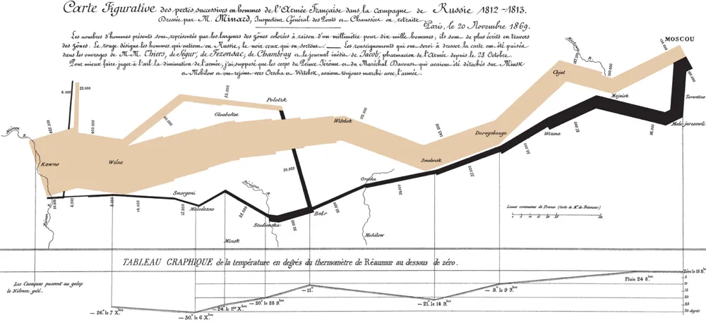
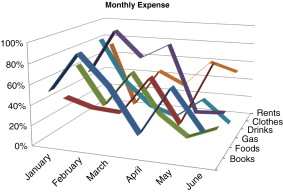
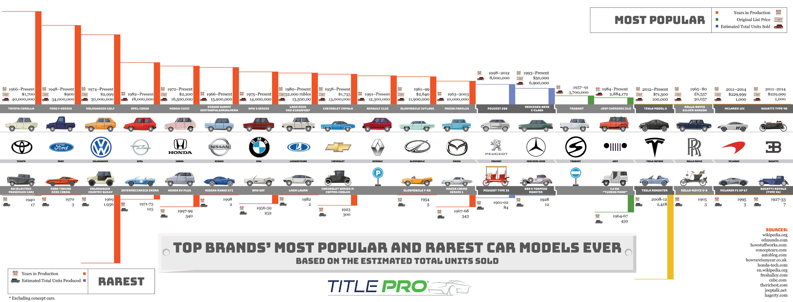

# Lecture 07 Outline: Data Visualization


1. Data Visualization with pandas, matplotlib, and seaborn
2. Design Principles for Effective Visualization
3. Advanced Visualization

<!--
ADD SPEAKER NOTES FOR THIS SLIDE IN THIS COMMENT
-->

---

# Brief Recap: Essential Python Concepts

- **Importing Libraries**
  - Use `import` statements to include external libraries.
    ```python
    import pandas as pd
    import matplotlib.pyplot as plt
    import seaborn as sns
    ```
- **Working with DataFrames**
  - DataFrames are table-like data structures provided by pandas.
    ```python
    df = pd.read_csv('data.csv')
    ```

---

# Introduction to Data Visualization Tools

- **pandas**
  - High-level data manipulation library.
  - Built-in plotting methods that simplify creating visualizations from DataFrames.
- **Matplotlib**
  - Foundation library for data visualization in Python.
  - Offers detailed control over plots.
- **Seaborn**
  - Statistical data visualization library.
  - Provides attractive default styles and color palettes.

---

# pandas: Built-in Plotting

## Introduction

- pandas provides convenient plotting methods directly on DataFrames and Series.
- Simplifies the creation of plots without explicitly using Matplotlib commands.
- Basic workflow:
  1. Create plot with df.plot() or series.plot()
  2. Plots display automatically in Jupyter notebooks
  3. For scripts, use plot.show()

---

## Important Methods in pandas

### 1. `plot()`: Line Plot

- **Explanation**: Plots DataFrame or Series data as lines.
- **Structure**:
  ```python
  df.plot(x='column1', y='column2', kind='line', marker, title)
  ```

---


### 2. `hist()`: Histogram

- **Explanation**: Plots a histogram of a single column or series.

```python
df['Age'].hist(bins=10, color='skyblue', alpha=0.7)
```

---

# LIVE DEMO!

---
# Matplotlib: The Foundation

## Introduction

- **Matplotlib**  most widely used plotting library - the basic building block behind most other Python visualization libraries.
- Workflow:
  1. Create figure with plt.figure()
  2. Add data with plt.plot() or other plot types
  3. Customize with labels, title, etc.
  4. Display with plt.show()
- Concepts
  - **Figure**: The overall container for all plot elements.
  - **Axes**: The area where data is plotted (can be thought of as individual plots).

---

## Important Methods in Matplotlib

### 1. `plot()`: Basic Line Plot

- **Explanation**: Creates a simple line plot connecting data points.
- **Structure**:
  ```python
  plt.plot(x, y, marker, linestyle, color, label)
  ```
  - **Required Arguments**:
    - `x`: Data for the x-axis.
    - `y`: Data for the y-axis.
  - **Optional Arguments**:
    - `marker`: Style of the data point markers (e.g., `'o'` for circles).
    - `linestyle`: Style of the line connecting data points (e.g., `'-'` for solid line).
    - `color`: Color of the line.
    - `label`: Label for the legend.

---

### 2. `scatter()`: Scatter Plot

- **Explanation**: Creates a scatter plot of x vs. y, useful for showing relationships between variables.
- **Structure**:
  ```python
  plt.scatter(x, y, s, c, alpha)
  ```
  - **Required Arguments**:
    - `x`: Data for the x-axis.
    - `y`: Data for the y-axis.
  - **Optional Arguments**:
    - `s`: Size of markers.
    - `c`: Color of markers.
    - `alpha`: Transparency level of markers.

---

### Additional Plot Types in Matplotlib

- **Bar Plot**:
  ```python
  plt.bar(categories, values)
  ```
- **Histogram**:
  ```python
  plt.hist(data, bins=10)
  ```
- **Box Plot**:
  ```python
  plt.boxplot(data)
  ```
- **Pie Chart**:
  ```python
  plt.pie(sizes, labels=labels)
  ```
- **Subplots**:
  ```python
  fig, axs = plt.subplots(2, 2)  # Creates a 2x2 grid of subplots
  axs[0, 0].plot(x, y)  # Plot in the first subplot
  ```
- **Image Display**:
  ```python
  plt.imshow(image_data)
  ```
- **Contour Plot**:
  ```python
  plt.contour(X, Y, Z)  # For line contours
  plt.contourf(X, Y, Z)  # For filled contours
  ```
- **Error Bars**:
  ```python
  plt.errorbar(x, y, yerr=error)
  ```

---

# Resources for Further Learning

- **Matplotlib Documentation**: [matplotlib.org](https://matplotlib.org/)
- **pandas Visualization Guide**: [pandas.pydata.org](https://pandas.pydata.org/pandas-docs/stable/user_guide/visualization.html)
- **Seaborn Tutorials**: [seaborn.pydata.org](https://seaborn.pydata.org/tutorial.html)
- **Troubleshooting Tips**: Search for errors on Stack Overflow or consult the official documentation.

---

# LIVE DEMO!

---


# Seaborn: Statistical Data Visualization

## Introduction

- **Seaborn** enhances Matplotlib's functionality by providing high-level interfaces.
- Ideal for statistical plots and works well with pandas DataFrames.
- Basic workflow:
  1. Create plot with sns.scatterplot() or other plot types
  2. Plots display automatically in Jupyter notebooks
  3. For scripts, use plt.show() since Seaborn uses Matplotlib backend

---


## Important Methods in Seaborn

### 1. `scatterplot()`: Scatter Plot

- **Explanation**: Creates enhanced scatter plots with additional functionalities.
- **Structure**:
  ```python
  sns.scatterplot(data=df, x='x_col', y='y_col', hue='category', size='value')
  ```

---

### Additional Plot Types in Seaborn

- **Histogram and KDE Plot**:
  ```python
  sns.histplot(data=df, x='BMI', kde=True)
  ```
- **Box Plot**:
  ```python
  sns.boxplot(data=df, x='AgeGroup', y='Cholesterol')
  ```
- **Heatmap**:
  ```python
  sns.heatmap(df.corr(), annot=True, cmap='coolwarm')
  ```
- **FacetGrid**:
  ```python
  g = sns.FacetGrid(df, col='Gender')
  g.map(sns.histplot, 'BMI')
  ```

---

### Additional Plot Types in Seaborn

- **Line Plot**:
  ```python
  sns.lineplot(data=df, x='Year', y='Value')
  ```
- **Bar Plot**:
  ```python
  sns.barplot(data=df, x='Category', y='Value')
  ```
- **Violin Plot**:
  ```python
  sns.violinplot(data=df, x='Category', y='Value')
  ```
- **Pair Plot**:
  ```python
  sns.pairplot(data=df, hue='Category')
  ```

---

### Customization in Seaborn

- **Setting Plot Style**:
  ```python
  sns.set_style("whitegrid")
  ```
- **Color Palettes**:
  ```python
  sns.set_palette("husl")
  ```
- **Figure Size**:
  ```python
  # Uses an arcane syntax within `set_theme` or `set_context`
  # set_theme can also set the style (d'uh)
  sns.set_theme(style="whitegrid", rc={"figure.figsize": (10, 6)})
  ```

---

# LIVE DEMO!

---


---
## Florence Nightingale: The Rose Diagram

- **Coxcomb Chart (Rose Diagram)**
  - Visualized causes of mortality during the Crimean War.
  - Highlighted the impact of poor sanitary conditions.

- **Impact**
  - Influenced medical reform and sanitary practices.
  - Early use of data visualization to drive policy change.

---

## COVID-19 Dashboard by Johns Hopkins University


- **Real-Time Visualization**
  - Tracked global COVID-19 cases, recoveries, and deaths.

- **Effective Use of Maps and Time Series**
  - Interactive and continuously updated.

- **Global Impact**
  - Became a crucial resource for researchers, policymakers, and the public.

---

# Introduction to Design Principles

- **Importance of Good Design**
  - Enhances comprehension and retention
  - Communicates data accurately and ethically

- **Based on Works of Edward Tufte and Claus O. Wilke**
  - Focus on clarity, precision, and efficiency in data presentation

---

# Key Concepts

## Simplify and Focus

- **Eliminate Non-Essential Elements**
  - Remove unnecessary gridlines, backgrounds, and decorations

- **Highlight Key Data**
  - Use visual emphasis (bolding, color) to draw attention to important information

---



---
## Edward Tufte: The Pioneer of Data Visualization

- **Data-Ink Ratio**
  - The proportion of ink used to present actual data compared to the total ink used in the graphic.

- **Chartjunk**
  - Unnecessary or distracting decorations in data visualizations that do not improve the viewer's understanding.

- **Notable Works**
  - *The Visual Display of Quantitative Information*
  - *Envisioning Information*
  - *Beautiful Evidence*

---

### Bad Examples

- **Issues**:
  - Distracting colors
  - Misleading scales
  - Unnecessary 3D effects

---



---


---

### Better Example

- **Features**:
  - Clear labels and titles
  - Minimalist design
  - Accurate representation of data

---


---


---


---


---


---

# "Legal" Representation of Data (chartcrime)

- **Avoid Misleading Visuals**
  - Start axes at zero when appropriate to prevent exaggeration
  - Use consistent scales across related visuals

- **Accurate Data Representation**
  - Do not manipulate visuals to mislead or bias the audience
  - Clearly indicate any data exclusions or manipulations

- **Functional Use**
  - Differentiate data categories meaningfully
  - Use color to highlight important data points

- **Accessibility**
  - Use colorblind-friendly palettes (e.g., Viridis, Cividis)
  - Ensure sufficient contrast between colors

---

# Additional Resources

- **"The Visual Display of Quantitative Information"** by Edward Tufte
- **"Fundamentals of Data Visualization"** by Claus O. Wilke
- [**"Tufte's Principles of Data-Ink"** Liu & Zhuang](https://jtr13.github.io/cc19/tuftes-principles-of-data-ink.html)
- **Color Brewer 2**: [colorbrewer2.org](http://colorbrewer2.org/) for choosing colorblind-friendly palettes

---

# LIVE DEMO!

*(sort of)*

---

# Interactive Activity

## Critiquing a Visualization

- **Exercise**:
  - Examine the following chart and identify areas for improvement

- **Consider**:
  - Clarity of labels and titles
  - Use of color and chart elements
  - Ethical representation of data

---


---



---


---


---

# Advanced Visualization Techniques in Health Data Science

- **Plotnine**
  - Python implementation of the **Grammar of Graphics**
  - Inspired by R's **ggplot2**
  - Basic workflow:
    1. Create plot with ggplot()
    2. Add layers with + operator
    3. Display with plot.show() or plot.draw()
- **Command-Line Visualization**
  - Tools for visualizing data directly from the command line
  - Examples: **Mermaid.js**, **spark**
- **Interactive and BI Visualizations**
  - Tools for building interactive dashboards and applications
  - Examples: **Plotly Dash**, **Streamlit**

---

# Plotnine: Grammar of Graphics in Python 
*(Advanced)*

## Understanding the Grammar of Graphics

- **Theory**: A structured approach to data visualization that breaks down graphs into semantic components
  - **Data**: The dataset being visualized
  - **Aesthetics (aes)**: Mappings between data and visual properties (e.g., x, y, color)
  - **Geometries (geoms)**: Visual elements that represent data (e.g., points, lines)
  - **Facets**: Subsets of data shown in multiple plots
  - **Statistical Transformations (stats)**: Summarizing data (e.g., binning, smoothing)
  - **Scales**: Control mapping from data space to aesthetic space
  - **Coordinate Systems (coords)**: The space in which the data is represented (e.g., Cartesian, polar)

[plotnine.org](https://plotnine.org/)

---

## Plotnine vs. ggplot2

99.99% compatible with ggplot2

- **Syntax and Concepts**
  - Plotnine mirrors ggplot2's structure and functions
  - Beneficial for anyone familiar with R
- **Example Comparison**

  - **ggplot2 (R)**:
    ```R
    ggplot(data, aes(x, y)) + geom_point()
    ```
  - **Plotnine (Python)**:
    ```python
    (ggplot(data, aes('x', 'y')) + geom_point())
    ```

---

## Important Components in Plotnine

### `ggplot()`: Initialize a Plot

- **Explanation**: Creates a new plot object with data and aesthetic mappings
- **Structure**:
  ```python
  ggplot(data=DataFrame, mapping=aes('x_var', 'y_var'))
  ```
  - **Required Arguments**:
    - `data`: DataFrame containing the data
    - `mapping`: Aesthetic mappings created with `aes()`

---

## Plotnine Resources

There are whole books just on `ggplot2`. In fact, it started as a book

> Wilkinson, L. (2005), The Grammar of Graphics, 2nd ed., Springer

- [Data Visualization Ch 7](https://andrewirwin.github.io/data-visualization/grammar.html), Andrew Irwin
- [U of Iowa GoG Tutorial](http://homepage.stat.uiowa.edu/~luke/classes/STAT4580-2024/ggplot.html)
- [R Stats `ggplot2` Tutorial](http://r-statistics.co/Complete-Ggplot2-Tutorial-Part1-With-R-Code.html)

---

# Command-Line Visualization

## Mermaid.js

### Introduction

- **Mermaid.js**: A JavaScript-based tool for generating diagrams and flowcharts from text definitions.
- **Advantages**:
  - Quick creation of diagrams without graphic design tools.
  - Integration with markdown documents and presentations.
- **Structure**:
  ```markdown
  ```mermaid
  [Diagram Definition]
  ```
  ```
---

### Creating Diagrams with Mermaid.js

- **Example**:

  ```mermaid
  graph LR
    A[Start] --> B{Is the patient symptomatic?}
    B -->|Yes| C[Conduct Tests]
    B -->|No| D[Monitor Patient]
    C --> E[Treatment Plan]
    D --> E
    E --> F[Follow-up]
  ```


- **Nodes**:
  - `A`, `B`, `C`, `D`, `E`, `F` represent steps or decisions.
- **Edges**:
  - Arrows define the flow between nodes.
  - Labels like `|Yes|` and `|No|` represent decision outcomes.
  - 
---


---

### Integrating Mermaid.js into Documents

- **Markdown Files**:
  - Supported in many markdown editors and viewers (Notion, VSCode, Obsidian, ...)
- **Presentations**:
  - Tools like **Marp** allow embedding Mermaid diagrams in slides.
- **Version Control**:
  - Diagrams are text-based, facilitating collaboration and version tracking.
- **Command Line**:
  - `mermaid-cli` tool for rendering diagrams from the command line.
  ```bash
  npm install -g @mermaid-js/mermaid-cli
  mmdc -i input.mmd -o output.svg
  ```

---

## Gnuplot

Viewing graphs from the command line (you will almost never do this, ***but it's cool!***)

```bash
ping -c 10 google.com -i 0.2 | awk '/time=/{ print $(NF-1) }' | cut -d= -f2 | \
  gnuplot -e \
  "set terminal dumb size 90, 30; set autoscale; set title 'ping google.com';
   set ylabel 'ms'; set xlabel 'count'; plot '-'  with lines notitle";
```

---

```bash
                                       ping google.com
     55 +---------------------------------------------------------------------------+
        |       +        +       +        +       +        +       +        +       |
        |                                                                           |
     50 |-+                                                                 *     +-|
        |                                                                   *       |
        |                                         *                        * *      |
        |                                        * *                       * *      |
     45 |-+                                      *  *                     *   *   +-|
        |                                       *   *                     *   *     |
        |                                       *    *                   *     *    |
     40 |-+                                    *      *                  *     *  +-|
        |                                      *       *                *       *   |
 ms     |                                     *         *               *       *   |
     35 |-+                                   *          *             *        * +-|
        |                                    *           *             *         *  |
        |                                    *            *           *          *  |
     30 |-+            *****                *              ***        *           *-|
        |          ****     **              *                 *      *            * |
        |**********           **           *                   **    *             *|
        |                       *          *                     ** *              *|
     25 |-+                      **********                         *             +-|
        |                                                          *                |
        |       +        +       +        +       +        +       +        +       |
     20 +---------------------------------------------------------------------------+
        0       1        2       3        4       5        6       7        8       9
                                            count
```

---

## Sparkline

Because, why not?

- [https://github.com/holman/spark](https://github.com/holman/spark)

```bash
curl -s https://earthquake.usgs.gov/earthquakes/feed/v1.0/summary/2.5_day.csv | \
  sed '1d' | \
  cut -d, -f5 | \
  spark
▃█▅▅█▅▃▃▅█▃▃▁▅▅▃▃▅▁▁▃▃▃▃▃▅▃█▅▁▃▅▃█▃▁
```

---

# Interactive and BI Visualizations

### Overview

- **Plotly Dash**:
  - Focused on creating complex, customizable applications.
  - Uses Flask and React.js under the hood.
- **Streamlit**:
  - Designed for rapid development and simplicity.
  - Emphasizes minimal code to produce apps.
- **Tableau/Superset/Looker/PowerBI**:
  - Popular BI tools for creating interactive dashboards. ($$$)

---

## Plotly Dash: Building an App

### Code Example: Simple Dash App

```python
import dash
from dash import dcc, html
from dash.dependencies import Input, Output
import plotly.express as px
import pandas as pd

# Load data
df = pd.read_csv('data.csv')

# Initialize the app
app = dash.Dash(__name__)

# Define the layout
app.layout = html.Div([
    html.H1('Health Data Dashboard'),
    dcc.Dropdown(
        id='age-dropdown',
        options=[{'label': age, 'value': age} for age in df['AgeGroup'].unique()],
        value=df['AgeGroup'].unique()[0]
    ),
    dcc.Graph(id='bmi-bloodpressure-scatter')
])

# Define the callback
@app.callback(
    Output('bmi-bloodpressure-scatter', 'figure'),
    [Input('age-dropdown', 'value')]
)
def update_graph(selected_age):
    filtered_df = df[df['AgeGroup'] == selected_age]
    fig = px.scatter(
        filtered_df, x='BMI', y='BloodPressure',
        title=f'BMI vs Blood Pressure for Age Group {selected_age}'
    )
    return fig

# Run the app
if __name__ == '__main__':
    app.run_server(debug=True)
```

---

### Code Explanation

- **Imports**:
  - `dash`, `dash_core_components` (`dcc`), `dash_html_components` (`html`), `dash.dependencies` for interactivity.
  - `plotly.express` for plotting.
- **Data Loading**:
  - Reads health data into a DataFrame.
- **App Initialization**:
  - Creates a Dash app instance.
- **Layout Definition**:
  - Contains a header, dropdown menu, and a graph component.
- **Callback Function**:
  - Updates the graph based on the selected age group from the dropdown.

---

### Output Description

- An interactive dashboard with:
  - A dropdown to select the age group.
  - A scatter plot of BMI vs. Blood Pressure that updates dynamically.

---

## Streamlit: Building an App

### Code Example: Simple Streamlit App

```python
import streamlit as st
import pandas as pd
import plotly.express as px

# Load data
df = pd.read_csv('data.csv')

# App title
st.title('Health Data Explorer')

# Sidebar filters
age_group = st.sidebar.selectbox('Select Age Group', df['AgeGroup'].unique())

# Filtered data
filtered_df = df[df['AgeGroup'] == age_group]

# Display data
st.write(f'Data for Age Group: {age_group}')
st.write(filtered_df)

# Plot
fig = px.scatter(filtered_df, x='BMI', y='BloodPressure',
                 title=f'BMI vs Blood Pressure for Age Group {age_group}')
st.plotly_chart(fig)
```

---

### Code Explanation

- **Imports**:
  - `streamlit` for the app interface.
  - `pandas` and `plotly.express` for data handling and plotting.
- **Data Loading**:
  - Reads the health data into a DataFrame.
- **App Components**:
  - `st.title()` sets the title.
  - `st.sidebar.selectbox()` creates a dropdown in the sidebar.
  - `st.write()` displays text and data.
  - `st.plotly_chart()` renders the plot.
- **Interactivity**:
  - Selecting an age group filters the data and updates the display and plot.

---

### Output Description

- A simple web app with:
  - A sidebar for selecting the age group.
  - Display of filtered data.
  - An interactive scatter plot.

---

## Deployment Considerations

- **Local Deployment**:
  - Run the app on your local machine for testing and development.
- **Sharing Apps**:
  - **Plotly Dash**:
    - Deploy on platforms like Heroku or Dash Enterprise.
  - **Streamlit**:
    - Use Streamlit Sharing or deploy on a cloud platform.
- **Requirements**:
  - Package dependencies specified in `requirements.txt`.

---

## Applications in Health Data Science

- **Interactive Data Exploration**:
  - Enable users to explore datasets dynamically.
- **Patient Data Dashboards**:
  - Visualize patient metrics for clinical decision support.
- **Educational Tools**:
  - Create apps to teach concepts using real data.

---

# Summary

- **Advanced Visualization Tools** offer powerful ways to represent and interact with health data.
- **Plotnine** brings the grammar of graphics to Python, allowing for elegant and complex static visualizations.
- **Command-Line Tools** like **Mermaid.js** enable quick diagram creation within documentation.
- **Interactive Frameworks** like **Plotly Dash** and **Streamlit** facilitate the development of data apps for deeper insights.

---

# Further Resources

- **Plotnine Documentation**: [plotnine.readthedocs.io](https://plotnine.readthedocs.io/)
- **Mermaid.js Documentation**: [mermaid-js.github.io](https://mermaid-js.github.io/)
- **Plotly Dash User Guide**: [dash.plotly.com](https://dash.plotly.com/)
- **Streamlit Documentation**: [docs.streamlit.io](https://docs.streamlit.io/)
- **Deployment Guides**:
  - Dash: [Deployment](https://dash.plotly.com/deployment)
  - Streamlit: [Sharing Apps](https://streamlit.io/sharing)

