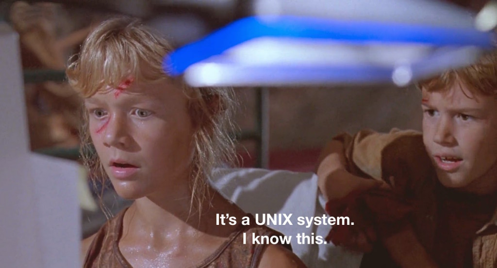

# Lecture 1: Introduction to Python and Command Line Basics
- Getting to the command line
- Navigating the file system with `*sh`
- Basic file operations (creating, moving, copying, deleting)
- Pipes and command chaining
- Introduction to shell scripting, variables, and `cron`
- Running Python scripts from the command line
- Python basics: syntax, data types, and control structures

---
# Class structure
- Lectures cover new material with hands-on demos
- Lectures end with a practical assignment
- Lab for help completing the practical assignment
- Always due the following week unless otherwise noted
---
# Resources: Command Line
- [LinuxCommand.org](http://linuxcommand.org/lc3_learning_the_shell.php)
- [The Linux Command Line book](http://linuxcommand.org/tlcl.php)
- [The Missing Semester](https://missing.csail.mit.edu/)
---
# Resources: Python
- _Whirlwind Tour of Python_, VanderPlas - author’s [website](https://jakevdp.github.io/WhirlwindTourOfPython/)
- _Think Python_, Downey - purchase or read at [Green Tea Press](https://greenteapress.com/wp/think-python/)
- _Hitchhiker’s Guide to Python!_ - official [documentation](https://docs.python-guide.org/)

---
# Getting Help

 - RTFM `man COMMAND`
 - Ask the computer `COMMAND --help`
 - Ask a bigger computer (Claude, ChatGPT)
 - Come to lab!

---
# In the beginning there was `sh`

- Powershell
- sh
- bash
- csh
- zsh

---



---

# Getting to the Command Line

- Windows users:
  - PowerShell (built-in)
  - Windows Subsystem for Linux [wsl](https://learn.microsoft.com/en-us/windows/wsl/install) - containerized Linux
- Mac users:
  - Terminal (built-in)
- Cloud options:
  - GitHub Codespaces

---

# Command Line Navigation

- Print Working Directory:
  - `pwd` (Unix/Mac)
  - `Get-Location` (PowerShell)
- List Directory Contents:
  - `ls` (Unix/Mac)
  - `dir` (PowerShell)
- Change Directory: `cd path/to/directory`
- Special directories `.` and `..`

---

# File Operations

- Create Directory: `mkdir new_folder`
- Create Files: 
  - `touch file.txt` (Unix/Mac)
  - `New-Item file.txt` (PowerShell)
- Copy Files: `cp source destination`
- Move/Rename: `mv old_name new_name`
- Remove: `rm file.txt` (use with caution!)

---

# Viewing File Contents

- Display entire file:
  - `cat file.txt` (Unix/Mac)
  - `Get-Content file.txt` (PowerShell)
- View beginning/end:
  - `head file.txt` / `tail file.txt` (Unix/Mac)
  - `Get-Content file.txt -Head 10` (PowerShell)

---

# Simple Text Manipulation

- Search for patterns:
  - `grep pattern file.txt` (Unix/Mac)
  - `Select-String pattern file.txt` (PowerShell)
- Chaining commands with pipe `|` (more on pipes in a future lecture)
  ```
  cat file.txt | grep pattern
  ```
---

# Live Demo!

---
# Installing Python

- Download and install Python
	- Windows: python.org or [winget](https://winget.run/pkg/Python/Python.3.12)
	    - `winget install -e --id Python.Python.3.12`
	- WSL Ubuntu - `apt install python3`
- Mac: python.org or Homebrew (recommended)
    - Install Homebrew from [brew.sh](https://brew.sh)
    - Install python `brew install python3`
- Verify installation: 
```
❯ python3 --version
Python 3.12.5
```

---

# Text Editor Options

- Visual Studio Code (what I'll be using, also available on GitHub Codespaces)
- Sublime Text
- PyCharm
- Notepad
- `nano` for quick fixes from the command line
---
# Why VS Code?
- Free and ubiquitous in industry
- Readily available in GitHub Codespaces


  ```
  $ python
  >>> print("Hello, World!")
  ```
- Running scripts
  ```
  $ python my_script.py
  ```
  
---

# Python Syntax Overview

- Indentation matters!
- Comments use `#`
  ```python
  # This is a comment
  print("This is code")
  ```

---

# Basic Data Types

- Integers: `x = 5`
- Floats: `y = 3.14`
- Strings: `name = "Alice"`
- Variables, ducks, and assignment

---

# Simple Operations

- Arithmetic: `+`, `-`, `*`, `/`, `**` (power)
- Modulus: `%`
- String concatenation: `"Hello" + " " + "World"`

---

# Control Structures

- Equals ` ==` and Not Equals`!=`
- `<`, `>`, `<=`, `>=`
- `in`, and `not in`
- `^` as `not`

# Control Structures II

- If statements:
  ```python
  if x > 0:
      print("Positive")
  elif x < 0:
      print("Negative")
  else:
      print("Zero")
  ```

# Control Structures III
- Compound if statements with `|` as `or`, and `&` as `and`:
```python
if (x > 0) | (x < 0):
	print(“Non-zero”)
elif (x == 0) and (x == 0):
	print(“Very zero”)
else:
	# See string catenation below
	print(f“What kind of number is {x}?”) 
```

---

# Control Structures (cont.)

- For loops:
  ```python
  for i in range(5):
      print(i)
  ```

---

# Printing variables

- String concatenation: `print(“Hello, “ + variable + “!”)`
- Printing with f-strings: `print(f“Hello, {variable}!`
---
# Live Demo!

---

# Practical Exercise

1. Get everything installed (or use the cloud) and play around a bit
2. Create an account on GitHub
	1. Apply for [GitHub Education](https://docs.github.com/en/education/explore-the-benefits-of-teaching-and-learning-with-github-education/github-education-for-students/apply-to-github-education-as-a-student)
	2. [Join the course and see next week’s assignmnet](https://classroom.github.com/a/Z2sWwnXF)
3. Create a Python script that prints "Hello, Data Science!"
	1. Save it as `hello_ds.py`
	2. Run it from the command line
	3. Use command line to create a `scripts` folder and move your file into it
4. Write a Python script to solve the following:
	>If we list all the natural numbers below 10 that are multiples of 3 or 5, we get (3, 5, 6, 9). The sum of these multiples is 23. Find the sum of all the multiples of 3 or 5 below 1000.
5. Email me:
	1. GitHub username
	2. Answer to the problem above + script you wrote to solve it 
	3. Brief introduction (who are you, why are you here, anything you’re specifically hoping to get out of the course)
---

# Wrap-up

- We've covered Python basics and essential command line operations
- Assignment: Practice these concepts with provided exercises
- Next lecture: Version Control with Git and More Python

---

# Additional Resources

- [Official Python documentation](https://docs.python.org/3/)
- [PowerShell documentation](https://docs.microsoft.com/en-us/powershell/)
- [Bash manual](https://www.gnu.org/software/bash/manual/)
- [Codecademy Python course](https://www.codecademy.com/learn/learn-python-3)
